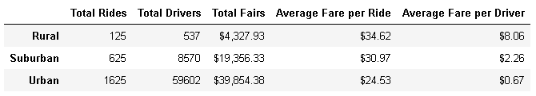
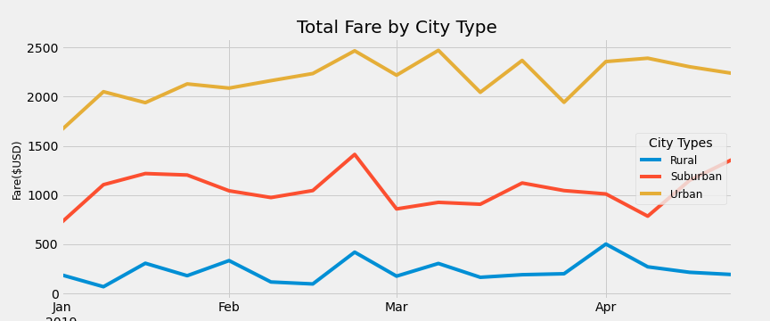

# PyBer_Analysis

#### Overview of the analysis:

This analysis summarizes how city type effects several key metrics of the ride sharing business. 

PyBer, a ride sharing app company, commissioned this analysis to gain a better understanding of these effects. The results will aid in several key decisions the company is making.

The analysis utilized data from January 2019  to early May 2019. Several key metrics are extracted from the data, then grouped by city type. These groups of key metrics are then summarized and charted over the time period.

#### Results:

Here you can see a table that summarizes the data grouped by city type for the entire dataset.

The chart below shows how the total fares by city type varies from January 2019 to early May 2019.

This list points out trends that can be seen in the data and the chart.

* The table shows that the number of rides, drivers and fares increase and the Average fare per ride and driver decrease as the size of the city increases.

* All three city types have at least one peak in fairs that correspond, the last week in February.

* In urban and suburban cities January is the slowest month. 
* Rural areas have the most consistency in fares.

#### Summary:

Business considerations:

1. In rural and suburban cities, consider balancing the ratio of drivers to number of rides to increase the average fair per driver, this would attract more drivers to these areas.
2. The last week in February is the busiest time of year.
3. The first week in January is the slowest time of the year.